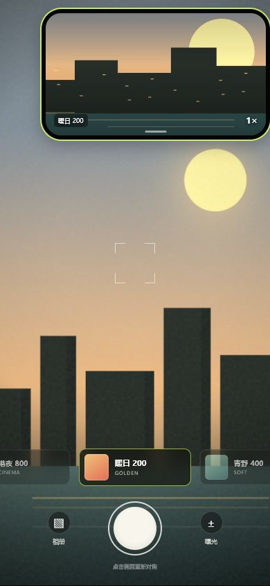

# 等光来 Wait for Light

一台会从灵动岛吐出相纸的数字拍立得。它让每张数字照片重新经历一次等待显影的浪漫。

- 在线体验：https://xiaoye616.github.io/island-film/
- 源代码：https://github.com/XIAOYE616/island-film



## 核心体验

- 支持真实摄像头、上传照片和无权限演示样片。
- 灵动岛下拉可连续展开为实时取景框，上滑或按 Esc 收回。
- 提供 0.5×、1×、2×、3× 固定焦段，使用非线性缓出和轻微回弹完成变焦。
- 六种原创胶片：银盐 100、港夜 800、暖日 200、青野 400、过期 98、日常 160。
- 根据画面亮度与色彩给出胶片推荐。
- 快门后灵动岛先缩回、再横向展开，显示照片缩略图、胶片型号和处理状态。
- 相纸从灵动岛下方吐出，经历模糊、偏色、颗粒和化学云雾消退的显影过程。
- 可摩擦相纸加速显影，完成后保存至本地相册或下载完整相纸。
- PWA 离线缓存，家庭照片默认只在浏览器本地处理。

## 参赛定位

- 作品类型：Web/H5
- 核心命题：把已经失去等待感的数字拍照，重新设计为一次有节奏、有触感的仪式。
- 适合设备：优先使用手机浏览器体验；桌面端提供居中的手机画幅。

## 本地运行

```powershell
python -m http.server 4174 --bind 127.0.0.1
```

访问 `http://127.0.0.1:4174/`。浏览器相机在生产环境中需要 HTTPS；没有相机权限时可点击“先看演示”。

## 技术实现

项目使用原生 HTML、CSS、Canvas 和 JavaScript，无构建步骤、无第三方运行时依赖。Canvas 在客户端完成裁切、胶片色彩、颗粒、漏光、暗角和相纸导出；相册使用 `localStorage` 保存，最多保留 8 张。

## 隐私与边界

照片不会自动上传服务器。相机权限只在用户主动点击后申请；相机不可用时自动进入演示模式。项目中的“灵动岛”是应用内部的原创交互模拟，不声称控制 iOS 系统级 Dynamic Island。

## 开源调研

项目从公开仓库研究了相机预览、拍立得画廊和照片下载的通用交互，但吐片、显影、滤镜和视觉系统均为本项目原创实现。详细记录见 [SOURCES.md](./SOURCES.md)。
